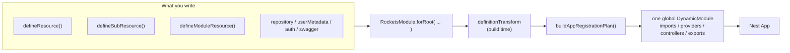
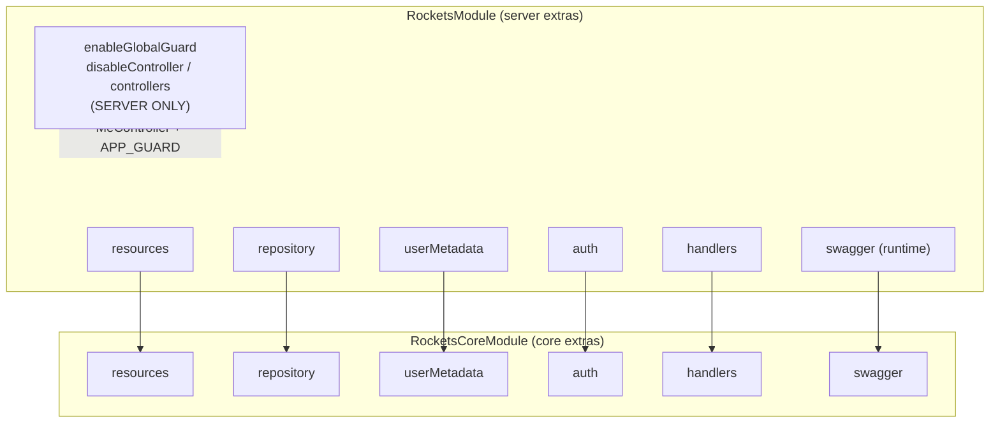
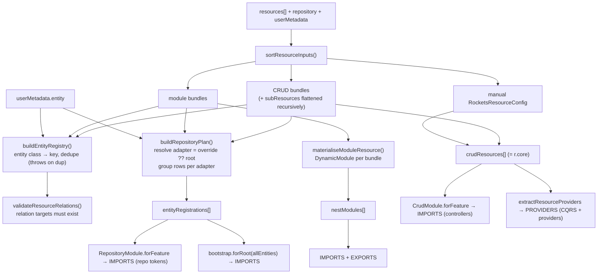
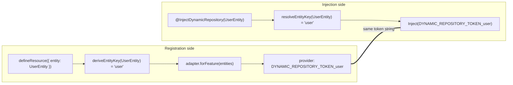
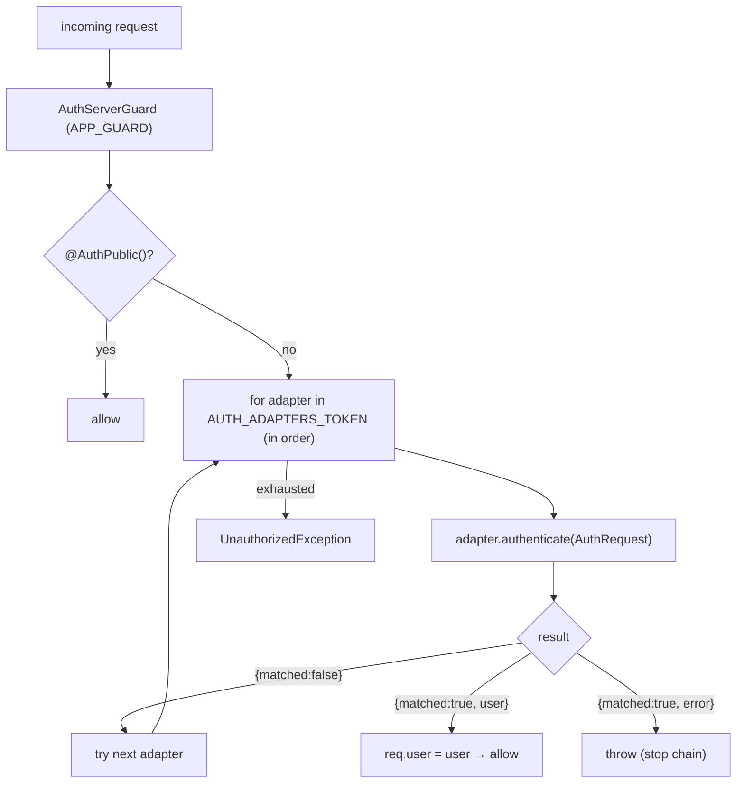
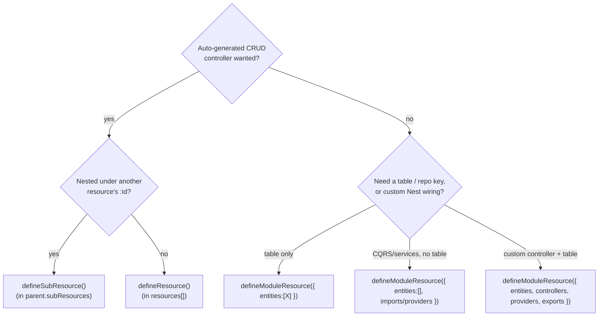

# Rockets — Configuration Entry Point

> Configuration reference for the **v2 DSL** (shipped). Field names below match
> the current `packages/*/src/**` (code wins over READMEs). The v2 redesign
> rationale, convertibility proof, and change-set live in §12.
> Diagrams are Mermaid — they render on GitHub and in most Markdown viewers.

---

## 0. Mental model (read this first)

You never hand NestJS a tree of modules. You write **declarative bundles**
(`defineResource`, `defineSubResource`, `defineModuleResource`) and a few
top-level fields (`repository`, `userMetadata`, `auth`), pass them to **one**
`RocketsModule.forRoot({...})`, and the module-definition transform converts
that into a single global `DynamicModule` (controllers, providers, repository
tokens, CQRS handlers, Swagger).



**Two layers, one surface.** `@bitwild/rockets` (server) is a thin presentation
layer over `@bitwild/rockets-core`. Server adds the `MeController`, the global
guard opt-in, and the `auth` chain; core does the actual resource→module
conversion. You only ever call `RocketsModule.forRoot` (server). Core's
`forRootAsync` is called internally.

---

## 1. The entry point — `RocketsModule.forRoot` / `forRootAsync`

The options object is split by NestJS's `ConfigurableModuleBuilder` into two
buckets with very different lifecycles:

| Bucket | When consumed | Can be async? | Examples |
|---|---|---|---|
| **runtime options** | at runtime via `RAW_OPTIONS_TOKEN` | yes (`forRootAsync` factory) | `settings`, `swagger` |
| **extras** | at **build time** inside `definitionTransform` | **no** — always static | `resources`, `repository`, `userMetadata`, `auth`, guard flags |

> Consequence: `forRoot` vs `forRootAsync` only changes how `settings`/`swagger`
> resolve. **`resources` / `repository` / `userMetadata` / `auth` are identical
> on both** — they are structural, not async-resolvable.

### 1.1 Full option shape (server — `RocketsModule.forRoot`)

| Field | Type | Req? | Default | Purpose |
|---|---|---|---|---|
| `resources` | `ReadonlyArray<ResourceInput>` | optional | `[]` | The feature bundles (CRUD + module + sub flattened). |
| `repository` | `RepositoryModuleInterface \| RepositoryBootstrap` | optional* | — | Root persistence adapter (TypeORM/Firestore/…). |
| `userMetadata` | `RocketsUserMetadataConfig` | **required at runtime** | — | `/me` entity + DTOs. Omit → throws when the metadata DTO token resolves. |
| `auth` | `AuthBootstrap \| AuthBootstrap[]` | optional | `[]` | Auth chain (external adapter and/or built-in). |
| `swagger` | `SwaggerUiOptionsInterface` | optional | — | Doc builder + UI. The **only** runtime field forwarded to core. |
| `settings` | `RocketsSettingsInterface` (empty today) | optional | — | Reserved; no fields yet. |
| `handlers` | `{ upsertUserMetadata?, getUserMetadata? }` | optional | built-ins | Override the user-metadata CQRS handlers. |
| `enableGlobalGuard` | `boolean` | optional | **on** (opt-out) | Register `AuthServerGuard` as `APP_GUARD` unless `=== false`. |
| `disableController` | `{ me?: boolean }` | optional | `{}` | Disable built-in `MeController`. |
| `controllers` | `DynamicModule['controllers']` | optional | — | Replace the auto controller set. |
| `global` | `boolean` | optional | **forced `true`** | `forRoot` always makes the module global. |

\* `repository` is optional in the type but persistence resolution throws if an
entity has neither a per-entity override nor a root adapter.

`*-server` / `*-core` split — what server forwards vs keeps:



**Server-only** (never reach core): `enableGlobalGuard`, `disableController`,
`controllers`, `settings`. These drive presentation: the `MeController` and the
`APP_GUARD` opt-in.

---

## 2. What you pass → what it becomes (the conversion)

The single conversion site is `buildAppRegistrationPlan()`, then
`definitionTransform` fans the plan into the module sections.

### 2.1 Plan shape

```ts
buildAppRegistrationPlan({ resources, repository?, userMetadata? }): AppRegistrationPlan

interface AppRegistrationPlan {
  crudResources:       RocketsResourceConfig[];       // → CrudModule.forFeature (controllers)
  entityRegistrations: RepositoryPersistenceConfig[]; // → RepositoryModule.forFeature (repo tokens), grouped per adapter
  nestModules:         DynamicModule[];               // → module-resource slices
}
```

> The plan carries **no controllers and no CQRS list**. Controllers come from
> imported `CrudModule.forFeature` / module slices. CQRS handlers are
> re-extracted later from `crudResources[].crud.operations[].queryHandler/commandHandler`.

### 2.2 Pipeline



Where artifacts land in the final `DynamicModule`:

| Artifact | Section | Via |
|---|---|---|
| CRUD controllers | `imports` | `CrudModule.forFeature(resource)` (one per CRUD resource) |
| Module-resource controllers | `imports` | inside each materialised slice |
| Core's own `controllers` | always `[]` | core emits none directly |
| CQRS handlers + resource `providers` | `providers` | `extractResourceProviders()` (deduped) |
| Entities → repo tokens | `imports` | `RepositoryModule.forFeature(group)` per adapter |
| Swagger | `imports` | one `SwaggerUiModule.registerAsync` |
| Re-exports | `exports` | tokens, `AuthServerGuard`, resource providers, module slices |

---

## 3. The dynamic-repository token contract (the key idea)

There is **no shared `*_ENTITY_KEY` constant** between registration and
injection. Both sides independently derive the same string key from the entity
class, so the tokens match.



- `deriveEntityKey`: strip trailing `Entity`, lowercase first char.
  `UserEntity → 'user'`, `PetTagEntity → 'petTag'`, `Order → 'order'`.
- `getDynamicRepositoryToken(key) → \`DYNAMIC_REPOSITORY_TOKEN_${key}\``.
- The concrete repository **provider is 100% adapter-owned** — core only
  forwards `{ module, entities }` groups; the adapter's `forFeature` builds the
  providers. Core never builds repository providers itself.
- String form (`@InjectDynamicRepository('billing/invoice')`) is the escape
  hatch for namespaced keys.

> **Branch note.** `InjectDynamicRepository` and `RepositoryModuleInterface` are
> provided by `@bitwild/rockets-repository`, which this branch treats as the
> active repository abstraction (`rockets-core` re-exports them so features
> import from core). No decorator-to-core migration is pending. The dynamic
> token contract above is unchanged: registration and injection both resolve the
> same entity key and token string.

---

## 4. `defineResource()` — top-level CRUD

**Only `entity` is required.** Everything else is derived or defaulted.

### Minimum

```ts
export const petResource = defineResource({
  entity: PetEntity,
  // key   → 'pet'                  (deriveEntityKey)
  // path  → 'pets'                 (pluralized kebab of key)
  // tags  → ['Pets']
  // operations → [List, Read, Create, Update, Delete]
  // DTOs default to the entity shape
});
```

### Complete (adapted from `examples/sample-server/src/resources/pet/pet.resource.ts`)

```ts
export const petResource = defineResource({
  entity: PetEntity,
  relations: (relation) => [
    relation(PetVaccinationEntity, 'vaccinations'),
    relation(PetTagEntity, 'petTags'),
  ],
  hooks: [PetOwnerStamp, PetOwnerOrSharedHook, PetUniqueRefHook, PetAuditLogHook],
  operations: {
    list:   { output: PetResponseDto },
    read:   { output: PetResponseDto },
    create: { input: PetCreateDto, output: PetResponseDto },
    update: { input: PetUpdateDto, output: PetResponseDto },
    delete: { soft: true, returnDeleted: true },
    restore:{ returnRestored: true },
  },
  // repository: firestoreRepo,   // optional per-resource adapter override
  subResources: {
    petTags: defineSubResource({ /* see §5 */ }),
  },
});
```

### Field reference (grouped)

| Group | Field | Type | Default |
|---|---|---|---|
| **Identity** | `entity` **(req)** | `Type<E>` | — |
| | `key` | `string` | `deriveEntityKey(entity)` |
| | `path` | `string \| string[]` | pluralized kebab of key |
| | `tags` | `string[]` | `[humanize(key)]` |
| **DTOs** | `dto` | `{ response?, paginated?, create?, update?, replace? }` | `{}` (resource-level fallback; prefer per-op `input`/`output`) |
| **Operations** | `operations` | `OperationName[] \| OperationsObject` | `[List, Read, Create, Update, Delete]` |
| | `operations.X` | `{ input?, output?, paginated?, handler?, hooks?, decorators?, path?, transactional?, requestOverride?, responseOverride? }` (`input`→`request.body`, `output`→`response.resource`) | — |
| | `operations.delete` | `+ { soft?, returnDeleted? }` | `soft=false` |
| | `operations.restore` | `+ { returnRestored? }` — only valid with `delete.soft` | — |
| **Relations** | `relations` | array or `(rel) => entries[]` | — |
| **Persistence** | `repository` | `RepositoryModuleInterface` | root `repository` adapter |
| **Hooks** | `hooks` | `RocketsEntityHookForResource<E>[]` | — (auto-registered) |
| **Handlers** | `handlers` | `{ list?, read?, create?, … }` of `Type` | — (auto-registered) |
| | `autoRegisterHandlers` | `boolean` | `true` |
| | `providers` | `Provider[]` — **extras only**, not handlers/hooks | `[]` |
| **AuthZ / Swagger** | `public` | `boolean` | `false` (removes `@ApiBearerAuth`; still passes the global guard) |
| | `decorators` | `ClassDecorator[]` | — |
| | `request` | `CrudRequestConfig` | `{ params: { id: uuid primary } }` |
| **Nesting** | `subResources` | `{ [K in relation prop of E]?: SubResource }` | — |

**Auto-extraction rule:** handlers declared in `operations.X.handler` / `handlers.X`
become `queryHandler` (List/Read) or `commandHandler` (writes) and are
auto-registered as providers (with `hooks`). **Do not also list them in
`providers`** — `providers` is for extra services only.

**Flat config (no `crud.crud`):** the returned `core` is
`RocketsResourceConfig = CrudModuleForFeatureOptionsInterface + { providers? }`,
i.e. exactly one `crud` level: `{ crud: { controller, operations }, providers }`.

---

## 5. `defineSubResource()` — nested under a parent

A sub-resource is **never** placed in `resources[]`. It is a value inside a
parent's `subResources` map, keyed by a **real relation property of the parent
entity** (typo → compile error). The parent materialises it into a peer CRUD
resource with a composed path and auto-injected `PathScopeGuard` + `PathScopeHook`.

```
parent path  +  :<parentKey>  +  segment
   /pets      +     /:petId      +    /tags     →   /pets/:petId/tags
```

### Minimum (secure by default)

```ts
defineSubResource({ entity: PetTagEntity })
// owner defaults to 'userId', scope on, FK derived (pet+Id → :petId).
// → /pets/:petId/tags with FK filter + ownership guard, zero config.
```

### Complete (verbatim shape from `pet.resource.ts`)

```ts
petTags: defineSubResource({          // key 'petTags' must be a PetEntity relation prop
  entity: PetTagEntity,
  segment: 'tags',                    // → /pets/:petId/tags (default would be 'pet-tags')
  tags: ['Pet Tags'],
  owner: 'userId',                    // ownership column (default 'userId'; `false` = public)
  // scope: false,                    // would disable FK filter+stamp+guard entirely
  // parentKey: 'animalId',           // FK + URL param override (default <parent>Id)
  // parentPk: 'companyId',           // parent PK column for the guard (default 'id')
  reloadAfterCreate: true,            // opt-in AfterCreateReloadHook (eager relations on create)
  hooks: [PetTagTagIdExistsHook],
  relations: (relation) => [
    relation(() => PetEntity, 'pet'),
    relation(() => TagEntity, 'tag'),
  ],
  operations: {
    list:   { output: PetTagResponseDto },
    read:   { output: PetTagResponseDto },
    create: { input: PetTagCreateDto, output: PetTagResponseDto },
    delete: {},
  },
})
```

### Field reference (sub-specific; inherits all `defineResource` fields except `path`)

| Field | Type | Req? | Default |
|---|---|---|---|
| `entity` | `Type<E> \| (() => Type<E>)` | **yes** | — (thunk allowed for circular imports) |
| `parentKey` | `string` | no | `${parentEntityKey}Id` (e.g. `petId`) — URL param **and** FK column |
| `parentPk` | `string` | no | `'id'` — parent PK column the guard looks up |
| `segment` | `string` | no | `kebab-case(mapKey)` — URL segment |
| `owner` | `string \| false` | no | `'userId'` — ownership column; `false` drops the guard (public) |
| `scope` | `boolean` | no | `true` — master switch (FK filter/stamp + guard); `false` = unscoped |
| `reloadAfterCreate` | `boolean` | no | `false` |
| *(inherited)* | `dto`, `operations`, `relations`, `hooks`, `handlers`, `providers`, `subResources`… | no | — |

---

## 6. `defineModuleResource()` — persistence rows + custom Nest slice

Use when you need entity keys and/or **hand-written** controllers/services/CQRS
(not an auto-generated CRUD controller). It contributes two things at once:
optional dynamic-repository rows (same plan as `defineResource`) **and** an
inline `DynamicModule` (so no extra `XModule` in `AppModule.imports`).

### Minimum (entity row only)

```ts
export const sampleAuthUserResource = defineModuleResource({
  entities: [UserEntity],            // class shorthand → key 'user'
});
```

### CQRS-only (`entities: []`) — consumes a repo another bundle registered

```ts
export const petTransferFeature = defineModuleResource({
  imports: [CqrsModule],
  controllers: [PetTransferController],
  providers: [TransferPetOwnershipHandler],
});
```

### Complete (entity + controller + service + exports)

```ts
export const githubFeature = defineModuleResource({
  entities: [GithubConnectionEntity],
  controllers: [GithubController],
  providers: [GithubConfig, GithubOAuthStateService, githubApiClientProvider(), GithubService],
  exports: [GithubService, GITHUB_API_CLIENT],   // public surface — see ⚠ below
});
```

### Field reference

| Field | Type | Notes |
|---|---|---|
| `entities` | `Array<Type \| { key?, entity, repository?, collection? }>` | defaults `[]`; bare class derives key; **per-entity `repository` override** = the way to put one table on a different adapter |
| `imports` | `DynamicModule['imports']` | e.g. `CqrsModule`, `OtpModule.forFeature(...)` |
| `controllers` | `DynamicModule['controllers']` | hand-written controllers |
| `providers` | `Provider[]` | services, hooks, guards, CQRS handlers, token literals |
| `exports` | `DynamicModule['exports']` | **globally injectable** — see rule |

### ⚠ Public-surface export rule

Because core is `global: true` and re-exports every module slice, **everything
in `exports[]` is injectable app-wide** — including the `inject:[...]` of an
outer `forRootAsync` factory. The collision risk is by **injection token**: two
bundles exporting the **same token** (the same class reference, or the same
string/symbol token) shadow each other (last one wins). Rule:

- crosses a feature boundary → `providers` **and** `exports`
- internal only → `providers` only
- collision risk → prefix the class (`BillingPriceFormatter`) or use an explicit
  injection token/symbol for shared cross-feature providers

> Note: `CLAUDE.md` rule 14 phrases this as "same class **name**". Nest keys
> providers by token (class reference), so two *distinct* classes that merely
> share a name are *different* tokens and don't actually collide — but they're a
> readability/foot-gun hazard. Reconcile the rule-14 wording with whoever owns
> `CLAUDE.md`.

Canonical minimum-surface example: the sample auth wiring exports **only**
`SampleAuthAdapter`; `AuthController` and `UserEntity` stay internal.

---

## 7. Auth — two modes

Both modes produce an `AuthBootstrap` passed to `forRoot({ auth })`. `auth`
accepts one bootstrap or a **chain** (array, tried in order).

```ts
interface AuthBootstrap<A extends AuthAdapterInterface = AuthAdapterInterface> {
  adapter: Type<A>;
  forRoot?: () => DynamicModule;   // host module: provides+exports the adapter
}
```



`AuthAdapterInterface` is a single method:

```ts
interface AuthRequest { headers; query; raw; }          // raw = escape hatch
type AuthAttemptResult =
  | { matched: false }                                   // not mine → next adapter
  | { matched: true; user: AuthorizedUser }              // ok → stamp req.user, stop
  | { matched: true; error: HttpException };             // mine but rejected → throw, stop

interface AuthAdapterInterface {
  authenticate(request: AuthRequest): Promise<AuthAttemptResult>;
}
```

**Global guard (default-on / opt-out):** `AuthServerGuard` is registered as
`APP_GUARD` **unless `enableGlobalGuard === false`** — enabled by default; you
opt **out**, never in. Routes are guarded unless explicitly made public
(`@AuthPublic()`) or the global guard is disabled.

### 7a. External auth (`@bitwild/rockets`) — you own `authenticate()`

Minimum (core stub shape):

```ts
function createStubAuthBootstrap(adapter) {
  return { adapter, forRoot: () => ({ module: class {}, providers: [adapter], exports: [adapter] }) };
}
```

Complete (`examples/sample-server/src/auth/define-sample-auth.ts`):

```ts
export function defineSampleAuth(): AuthBootstrap<SampleAuthAdapter> {
  return {
    adapter: SampleAuthAdapter,
    forRoot: () => ({
      module: class SampleAuthHostModule {},
      providers: [SampleAuthAdapter],
      controllers: [AuthController],
      exports: [SampleAuthAdapter],   // controller + entity stay internal
    }),
  };
}

RocketsModule.forRoot({
  auth: defineSampleAuth(),
  userMetadata: { entity: UserMetadataEntity, createDto: UserMetadataCreateDto, updateDto: UserMetadataUpdateDto },
  repository: defineTypeOrmRepository({ type: 'sqlite', database: ':memory:', synchronize: true }),
  resources: [ sampleAuthUserResource, petResource, /* … */ ],
});
```

### 7b. Built-in auth (`@bitwild/rockets-auth`) — `defineRocketsAuth`

Full JWT / signup / login / recovery / OTP / admin / invitation system. Returns
an `AuthBootstrap` (adapter defaults to `RocketsJwtAuthAdapter`).

> **The option shape is NOT `{ jwt, signup, login, … }`.** It is
> `DefineRocketsAuthInput = RocketsAuthAsyncOptions & { persistence, userMetadata, userCrud, … }`.
> The wire-protocol config lives under a nested `authentication` block.

```ts
type DefineRocketsAuthInput = RocketsAuthAsyncOptions & {
  persistence: { module: RepositoryModuleInterface; entities: { user, userCredentials, userOtp, role, userRole, federatedIdentity } };
  userMetadata: RocketsUserMetadataConfig;
  userCrud: { model; dto: { createOne; updateOne } };   // signup/admin CRUD
  invitationEntity?: Type;
  rocketsDefaults?: { enableGlobalGuard?: boolean };
  authAdapter?: Type<AuthAdapterInterface>;
};
```

Concept → field map:

| You want | Lives under |
|---|---|
| JWT secrets/signing | `authentication.settings.jwt.{access,refresh}` |
| login/strategies | `authentication.settings.strategies` |
| recovery | `authentication.ports.recoveryNotification` (**required**) + `verifyNotification` |
| otp | `otp` block + `settings.otp` + `disableController.otp` |
| signup / admin | `userCrud` (+ `handlers.*`) + `disableController.{signup,admin}` |
| oauth / federated | `federated` block — **OAuth provider modules are NOT in v8 yet (G1 gap)** |

Complete (`examples/sample-server-auth/src/app.module.ts`):

```ts
const repo = defineTypeOrmRepository({ type: 'sqlite', database: ':memory:', synchronize: true, dropSchema: true });

const rocketsAuthInput: DefineRocketsAuthInput = {
  persistence: { module: repo, entities: { user: UserEntity, userCredentials: UserCredentialEntity,
                 userOtp: UserOtpEntity, role: RoleEntity, userRole: UserRoleEntity, federatedIdentity: FederatedEntity } },
  invitationEntity: InvitationEntity,
  userMetadata: { entity: UserMetadataEntity, createDto: UserMetadataCreateDto, updateDto: UserMetadataUpdateDto },
  useFactory: () => ({
    services: { mailerService: buildSampleMailerService() },          // mailerService REQUIRED
    authentication: { ports: rocketsAuthNotificationPorts },          // recovery + verify ports
    settings: rocketsAuthRuntimeSettings,                             // role names, templates, otp
  }),
  userCrud: { model: UserDto, dto: { createOne: UserCreateDto, updateOne: SampleUserUpdateDto } },
  roleCrud: { model: RoleDto, dto: { createOne: RoleCreateDto, updateOne: RoleUpdateDto } },
};

const rocketsAuth = defineRocketsAuth(rocketsAuthInput);
const rocketsAuthResources = buildRocketsAuthResources(rocketsAuthInput.persistence, rocketsAuthInput.invitationEntity);

RocketsModule.forRoot({
  auth: rocketsAuth,
  userMetadata: rocketsAuthInput.userMetadata,
  enableGlobalGuard: false,                 // auth uses per-controller guards
  repository: repo,                         // SAME instance as persistence.module (reference equality!)
  resources: [ ...rocketsAuthResources, createPetResource(), /* … */ ],
});
```

> **Reference-equality trap:** the `repo` passed to `RocketsModule.repository`
> and to `defineRocketsAuth({ persistence: { module: repo } })` must be the
> **same object** — entities are grouped per adapter by identity.

---

## 8. Repository (root adapter) — database-agnostic

The `repository` field is the default persistence adapter. Core only knows two
contracts; the concrete backend is selected in your factory and is swappable.

```ts
interface RepositoryModuleInterface {                    // upstream minimal contract
  name: string;
  forFeature(entities: RepositoryProviderOptions[]): DynamicRepositoryModule;
}
interface RepositoryBootstrap extends RepositoryModuleInterface {
  forRoot(entities: ReadonlyArray<Type>): DynamicModule; // creates the root connection
}
```

Minimum:

```ts
repository: defineTypeOrmRepository({ type: 'sqlite', database: ':memory:', synchronize: true })
```

Selecting TypeORM (`examples/sample-server/src/repository/define-typeorm-repository.ts`):

```ts
export function defineTypeOrmRepository(connection): RepositoryBootstrap {
  return {
    name: 'typeorm-bootstrap',
    forFeature: (entities) => TypeOrmRepositoryModule.forFeature(entities),   // one repo token per key
    forRoot:    (entities) => TypeOrmModule.forRoot({ ...connection, entities: [...entities] }),
  };
}
```

Swap to Firestore = pass a `defineFirestoreRepository(...)` instead — **no
core/server change**. Per-entry repository overrides can be declared on any of:

- `defineResource({ repository })` — override for that one CRUD resource's entity
- `defineModuleResource({ entities: [{ entity, repository }] })` — per entity row
- `userMetadata.repository` — override for the metadata table

Each falls back to the root `repository` adapter when omitted.

---

## 9. userMetadata

```ts
interface RocketsUserMetadataConfig {
  entity: Type;                       // dynamic-repo row (key 'userMetadata') + /me route
  createDto: Type;                    // must extend UserMetadataCreatableInterface
  updateDto: Type;                    // must extend UserMetadataModelUpdatableInterface
  responseDto?: Type;                 // optional /me response
  repository?: RepositoryModuleInterface; // per-entity adapter override
}
```

Minimum (required at runtime — omit and the metadata DTO token throws):

```ts
userMetadata: {
  entity: UserMetadataEntity,
  createDto: UserMetadataCreateDto,
  updateDto: UserMetadataUpdateDto,
}
```

---

## 10. Decision guide



| Need | Use |
|---|---|
| Standard CRUD HTTP surface (`/pets`) | `defineResource` |
| Child route keyed by a parent relation (`/pets/:petId/tags`) | `defineSubResource` |
| Register an entity for `@InjectDynamicRepository` | `defineModuleResource({ entities:[X] })` |
| Pure CQRS/workflow, no new table | `defineModuleResource({ entities:[] })` |
| Hand-written controller + services | `defineModuleResource({ controllers, providers })` |
| One table on a different DB | `defineModuleResource` entity row `{ entity, repository }` |

---

## 11. Open items (flagged from the code)

1. **Repository import source** — on this branch `@bitwild/rockets-repository` is
   full self-contained source (no longer a thin `@concepta/nestjs-repository`
   wrapper). `RepositoryModuleInterface` / `InjectDynamicRepository` resolve from
   it directly; no decorator-to-core migration is pending here.
2. ✅ **Stale `defineResource` docstring fixed** (now "Required: `entity`; the
   rest derived"). Note: `authFeature` in the `defineModuleResource` docstring is
   still an *illustrative* name, not a real constant (the real sample is
   `sampleAuthUserResource` + `defineSampleAuth`).
3. **`SafeCrudContextInterceptor`** — a live workaround replacing upstream's
   global `CrudContextOverlay`; flagged for removal once upstream is mixed-app safe.
4. **OAuth (G1)** — federated/OAuth provider modules are not ported to v8 yet.
5. **`settings`** — both server and core `settings` are empty interfaces today
   (reserved slot).
6. **Pre-existing e2e/typecheck gaps on this branch** (independent of the v2
   work): `rockets-crud` photo-CRUD e2e ×2 + `rockets-server-auth` password e2e
   ×2 fail (31/35); `sample-server` has 2 `CrudCommandHandler` ctor typecheck
   errors and `sample-server-auth` 1 deep crud-import error.

---

> **Reading guide.** §1–§10 describe the **current shipped configuration
> surface** (the contract). §12 is **design rationale + change-set / history**.
> If the two ever conflict, the source code and §1–§10 are authoritative.

## 12. Signature v2 — design rationale & change-set (SHIPPED)

> **Status: implemented.** The v2 DSL described in §1–§10 is live in
> `packages/rockets-core/src/**`, with both sample apps migrated. Verified:
> build green, core unit 296/296, core e2e 47/47, package e2e 31/35 (the 4
> failures pre-date this work). This section keeps the *why* — the constraint,
> the convertibility proof, the locked naming, and the change-set.
>
> **Constraint:** "no breaking" meant **no functional / feature regression** —
> NOT "cannot change the entry config". The input DSL was ours to redesign; the
> hard rule was that every DSL field maps onto a real crud / repository
> capability (the conversion must work) and no capability is lost. The sample
> apps were migrated as the end-to-end proof.

### 12.1 Convertibility map (the proof — every field lands somewhere real)

Verified against source: crud `CrudRequestConfig = { params, body, bodyBatch, validation }`
(`crud-request-config.interface.ts`), `CrudQueryOptionsInterface.join: JoinClause[]`,
repository `RepositoryProviderOptions = { key, entity, relations }`
(`repository-provider-options.interface.ts`), `JoinClause` + relation `through`
metadata (`join-clause.interface.ts`, `repository-relation-metadata.interface.ts`).

| DSL v2 (input) | → crud target | → repository target |
|---|---|---|
| `entity` | `@CrudController({ entity: key })` | `RepositoryProviderOptions.entity` |
| `key` (or derived) | controller `entity` string key | `.key` → `DYNAMIC_REPOSITORY_TOKEN_<key>` |
| `path` | `@CrudController({ path })` | — |
| `tags` | `@ApiTags` | — |
| `repository` | — | `RepositoryModuleInterface.forFeature` (root or per-resource) |
| `operations.create.input` | `@CrudCreate({ request: { body } })` | — |
| `operations.read.output` | `response: { resource }` | — |
| `operations.list.paginated` | `response: { paginated }` | — |
| `operations.X.handler` | `commandHandler` / `queryHandler` | — |
| `operations.delete.soft` | `@CrudSoftDelete` vs `@CrudDelete` | `@DeleteDateColumn` (adapter) |
| `relations` (`federated`, `distinctFilter`) | `CrudJoin` / `join: JoinClause[]` | `relations: Record<name, RelationActionConfig>` |
| sub-resource link (direct FK) | `request.params` + `PathScopeHook` (where + stamp) | `WhereCondition` on FK column |

**M:N note:** the repository models junctions (`through: { relation, fromKey, toKey }`)
and `WhereCondition.relation` lets a filter cross a join — so M:N is supported for
**reads** (list/read through the junction). A **writable** sub-resource stays a
direct 1:N FK (you stamp one column on create), which is why a junction is exposed
as its own entity (e.g. `PetTag`), not as `Tag` directly. No change needed — just
do not present join as the parent-child association mechanism.

### 12.2 Naming decisions (locked)

- **Per-operation DTOs: `input` / `output`.** Not `body` (write-only word) and not
  `request` — `request` is already the `{ params, body, bodyBatch, validation }`
  envelope in crud, so it is taken. `input → request.body`, `output → response.resource`.
- **`repository` everywhere.** Single name for "which adapter": root, per-resource,
  per-entity, `userMetadata`. Replaces `persistence.module`.

### 12.3 Final signatures

```ts
// Only `entity` is required in every factory; everything else derives or defaults.

// ── operations: key present = exposed; {} = defaults; {…} = configured ──
type OperationsConfig = {
  list?:    { output?: Type; paginated?: Type; handler?: Type; hooks?: Hook[]; ... };
  read?:    { output?: Type; handler?: Type; hooks?: Hook[]; ... };
  create?:  { input?: Type; output?: Type; handler?: Type; hooks?: Hook[]; ... };
  update?:  { input?: Type; output?: Type; handler?: Type; hooks?: Hook[]; ... };
  replace?: { input?: Type; output?: Type; ... };
  delete?:  { soft?: boolean; returnDeleted?: boolean; ... };
  restore?: { returnRestored?: boolean; ... };
};
// `output` is always the single-item DTO; `paginated` is the list wrapper (auto-derived if omitted).
// `operations.X.handler` is the preferred v2 location; the resource-level
// `handlers` block is still supported and auto-registers unless
// `autoRegisterHandlers: false`.

// ── defineResource ──
defineResource({ entity: PetEntity });                 // MIN — derives key/path/tags/ops/DTOs
defineResource({
  entity: PetEntity,
  repository: firestoreRepo,                            // was persistence.module
  relations: (rel) => [
    rel(PetTagEntity, 'petTags'),
    rel(OwnerEntity, 'owner', { federated: true }),
  ],
  hooks: [PetOwnerStamp],
  operations: {
    list:   { output: PetDto },
    read:   { output: PetDto },
    create: { input: PetCreateDto, output: PetDto },
    update: { input: PetUpdateDto, output: PetDto },
    delete: { soft: true, returnDeleted: true },
  },
  public: false,
  decorators: [UseInterceptors(X)],
  providers: [SomeService],
  subResources: { petTags: defineSubResource({ /* … */ }) },
});

// ── defineSubResource ──
petTags: defineSubResource({ entity: PetTagEntity });  // MIN — link derives (pet+Id → :petId, FK petId)
petTags: defineSubResource({
  entity: PetTagEntity,
  parentKey: 'petId',          // child FK → parent; only when it differs from <parent>+Id
  parentPk: 'id',              // parent PK column for the ownership guard (default 'id')
  segment: 'tags',             // URL segment; only when it differs from the map key
  owner: 'userId',             // ownership column; default-on ('userId'). `owner: false` disables the guard.
  scope: true,                 // path-scope FK filter — default on; `scope: false` disables FK scoping + guard
  reloadAfterCreate: true,
  relations: (rel) => [rel(() => PetEntity, 'pet'), rel(() => TagEntity, 'tag')],
  operations: {
    list:   { output: PetTagDto },
    create: { input: PetTagCreateDto, output: PetTagDto },
    delete: {},
  },
});

// ── defineModuleResource ──
defineModuleResource({ entities: [AuditLogEntity] });
defineModuleResource({ imports: [CqrsModule], controllers: [PetTransferController], providers: [TransferPetOwnershipHandler] });
defineModuleResource({
  entities: [GithubConnectionEntity, { entity: SessionEntity, repository: firestoreRepo }],
  controllers: [GithubController],
  providers: [GithubService, githubApiClientProvider()],
  exports: [GithubService, GITHUB_API_CLIENT],         // public surface — collision risk
});

// ── relation: bound canonical form ──
relations: (rel) => [
  rel(TagEntity, 'tags'),                              // cardinality inferred from metadata
  rel(OwnerEntity, 'owner', { federated: true }),
  rel(() => PetEntity, 'pet'),                         // thunk for import cycles
];
```

### 12.4 Change set (DSL vs today — all map to crud/repository)

| Today | v2 | Note |
|---|---|---|
| `persistence.module` / `repository` (mixed) | `repository` everywhere | unify; → `RepositoryModuleInterface.forFeature` |
| `operations.X.body` | `operations.X.input` | → `request.body` |
| `operations.X.response` | `operations.X.output` | → `response.resource` |
| `operations: [...]` string-array | keyed object (preferred) | **both still supported top-level**; keyed object preferred for customized ops; **sub-resources require the keyed object** (parent `@ApiParam` appended per op) |
| `handlers.X` block / `operations.X.handler` | `operations.X.handler` (preferred) | **`handlers` block still supported** + auto-registered unless `autoRegisterHandlers: false` |
| `parentParam` + `parentForeignKey` + `parentOwnerColumn` + (none) | `parentKey` + `owner` (default `'userId'`) + `scope` + `parentPk` | owner decoupled from scope; parent PK now configurable |
| `relation(Source, Target, prop)` array | `rel(Target, prop)` bound | source implicit |
| `urlSegment` | `segment` | — |

### 12.5 Still rejected — technical, not "breaking"

- **Auto-detect PK from repository metadata.** Independent of the breaking rule:
  the metadata is not available at decoration time (the DB is not connected when
  `defineResource` runs in the module-definition transform), and it breaks
  adapter-agnosticism (Firestore has no SQL PK). Keep the explicit, adapter-neutral
  param config; `parentPk` is a *declared* field, not introspection.
- **Weakening `subResources` map-key typing.** The key constrained to a parent
  relation property is a real compile-time guarantee — keep it.
- **Join as the parent-child association.** A writable sub-resource is a direct 1:N
  FK; M:N via join stays a read-only relation feature (§12.1).

### 12.6 Rollout (done)

1. ✅ v2 DSL on the factories + conversion layer (`input`→`request.body`,
   `output`→`response.resource`, `repository` unification, sub-resource fields),
   every crud/repository capability intact.
2. ✅ `sample-server` + `sample-server-auth` migrated; build + core e2e green.
3. ✅ Factory JSDoc fixed (stale "Required: key, entity, path, tags" → only
   `entity`; minimal `{ entity: X }` `@example` leads each factory).

Two behavior shifts (approved, not regressions): `owner` now **defaults to
`'userId'`** (secure-by-default; previously a sub threw if you forgot it), and
`parentPk` makes non-`id` parent PKs work (previously hardcoded `'id'` → silent
404). The unused param≠FK divergence (`parentForeignKey`) was dropped with the
`parentParam`+`parentForeignKey` → `parentKey` collapse.
